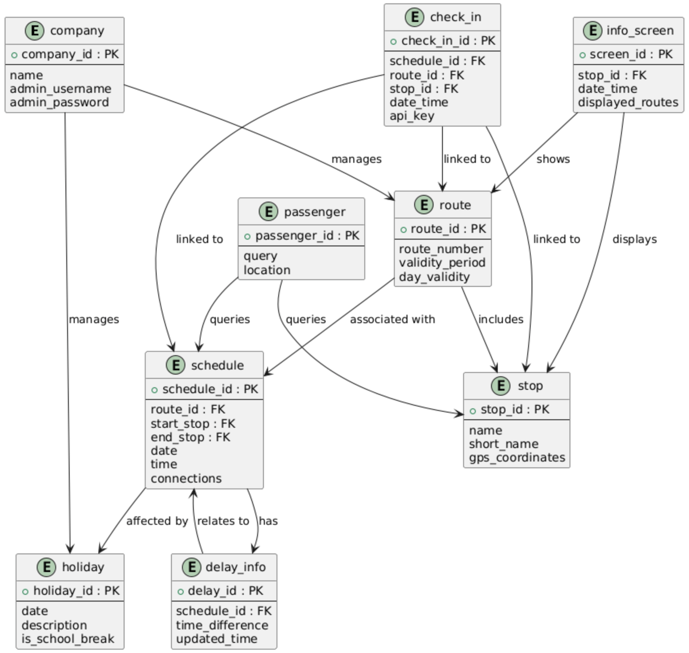
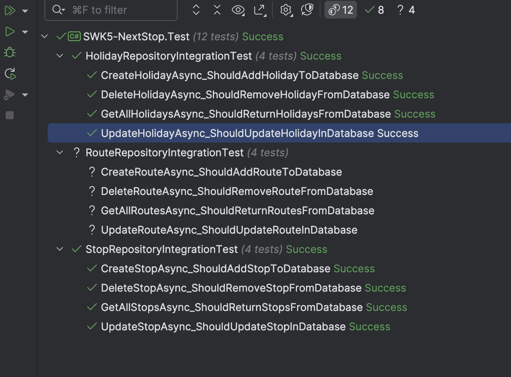

# SWK5 NextStop (Jack Heseltine)

## Part 1 (Ausbaustufe 1)

This is a GitHub (Classroom) managed project.

### Project Structure

```
+ SWK5-NextStop
|- Solution Items
|- SWK5-NextStop
|-- Dependencies
|-- Properties
|-- appsettings.json
|-- Dockerfile
|-- Program.cs
|-- README.md
|- SWK5-NextStop.Domain/.DAL/.Infrastructure/.Test (Sub-Projects for Part 1)
+ Scratches and Consoles
```

### Data Model

#### Entity Relationships



#### Additional Info About Relationships

- **company - route**: One-to-Many 
  - A company can manage multiple routes, but each route is managed by only one company
- **company - holiday**: Many-to-Many 
  - A company can manage multiple holidays, and each holiday can be managed by many companies (it is one list)
- **route - stop**: Many-to-Many 
  - A route can include multiple stops, and a stop can be part of multiple routes
- **route - schedule**: One-to-Many 
  - A route can have multiple schedules, but each schedule belongs to only one route
- **schedule - holiday**: Many-to-One 
  - Multiple schedules can be affected by the same holiday
- **check_in - schedule**: Many-to-One
  - Multiple check-ins can be linked to the same schedule
- **check_in - route**: Many-to-One 
  - Multiple check-ins can be linked to the same route
- **check_in - stop**: Many-to-One 
  - Multiple check-ins can be linked to the same stop 
- **schedule - delay_info**: One-to-Many 
  - A schedule can have multiple delay records
- **delay_info - schedule**: Many-to-One 
  - Each delay record is associated with one schedule
- **passenger - stop**: Many-to-One 
  - Multiple passengers can query the same stop
- **passenger - schedule**: Many-to-One 
  - Multiple passengers can query the same schedule
- **info_screen - stop**: Many-to-One 
  - Multiple screens can display information for the same stop
- **info_screen - route**: Many-to-One 
  - Multiple screens can display routes

#### Table-Creation Script

```postgresql
-- Create table statements for the full entity relationship diagram

CREATE TABLE company (
    company_id SERIAL PRIMARY KEY,
    name VARCHAR(255) NOT NULL,
    admin_username VARCHAR(255) NOT NULL,
    admin_password VARCHAR(255) NOT NULL
);

CREATE TABLE route (
    route_id SERIAL PRIMARY KEY,
    route_number VARCHAR(255) NOT NULL,
    validity_period VARCHAR(100),
    day_validity VARCHAR(50),
    company_id INT,
    FOREIGN KEY (company_id) REFERENCES company(company_id)
);

CREATE TABLE stop (
    stop_id SERIAL PRIMARY KEY,
    name VARCHAR(255) NOT NULL,
    short_name VARCHAR(50),
    gps_coordinates VARCHAR(50)
);

CREATE TABLE schedule (
    schedule_id SERIAL PRIMARY KEY,
    route_id INT,
    validity_start DATE,
    validity_stop DATE,
    date DATE NOT NULL,
    time TIME NOT NULL,
    connections INT,
    FOREIGN KEY (route_id) REFERENCES route(route_id)
);

CREATE TABLE check_in (
    check_in_id SERIAL PRIMARY KEY,
    schedule_id INT,
    route_id INT,
    stop_id INT,
    date_time TIMESTAMP NOT NULL,
    api_key VARCHAR(255) NOT NULL,
    FOREIGN KEY (schedule_id) REFERENCES schedule(schedule_id),
    FOREIGN KEY (route_id) REFERENCES route(route_id),
    FOREIGN KEY (stop_id) REFERENCES stop(stop_id)
);

CREATE TABLE delay_info (
    delay_id SERIAL PRIMARY KEY,
    schedule_id INT,
    time_difference INT,  -- in minutes
    updated_time TIMESTAMP NOT NULL,
    FOREIGN KEY (schedule_id) REFERENCES schedule(schedule_id)
);

CREATE TABLE holiday (
    holiday_id SERIAL PRIMARY KEY,
    date DATE NOT NULL,
    description VARCHAR(255),
    is_school_break BOOLEAN NOT NULL,
    company_id INT,
    FOREIGN KEY (company_id) REFERENCES company(company_id)
);

CREATE TABLE passenger (
    passenger_id SERIAL PRIMARY KEY,
    query VARCHAR(255),
    location VARCHAR(255)
);

CREATE TABLE info_screen (
    screen_id SERIAL PRIMARY KEY,
    stop_id INT,
    date_time TIMESTAMP NOT NULL,
    displayed_routes VARCHAR(255),
    FOREIGN KEY (stop_id) REFERENCES stop(stop_id)
);

CREATE TABLE route_stop (
    route_id INT,
    stop_id INT,
    sequence_number INT,
    PRIMARY KEY (route_id, stop_id),
    FOREIGN KEY (route_id) REFERENCES route(route_id),
    FOREIGN KEY (stop_id) REFERENCES stop(stop_id)
);
```

#### Initial Testdata

Note: I want to adapt this project about bus stops/schedules to a sort of event management system for KHG, the Catholic University Association here in Linz, where there is a need for such a system and I believe the metaphor does travel. This will be visible in the following test data, which is not, exactly suitable for actual buses, but will nevertheless be up to spec (so that buses and schedules for all of Linz, say, could be entered).

Note 2, on Adaptability: In keeping with the project spec the table names `passenger` and `company` as well as the notion `is_school_break` (`holiday`) are assigned, but these would translate semantically to `user` (maybe `resident`), (IT) `admin` (most likely), and `is_university_break`, respectively.

Note 3, on Language: The use case described is intended for an English-speaking audience at a (formally) German-speaking institution, in Austria.

```postgresql
-- Insert holiday data for 2024 and 2025
INSERT INTO holiday (holiday_id, date, description, is_school_break)
VALUES
  (1, '2024-01-01', 'New Year''s Day', FALSE),
  (2, '2024-12-25', 'Christmas Day', FALSE),
  (3, '2024-04-01', 'Easter Monday', FALSE),
  (4, '2025-01-01', 'New Year''s Day', FALSE),
  (5, '2025-12-25', 'Christmas Day', FALSE),
  (6, '2025-04-21', 'Easter Monday', FALSE);

-- Insert stop data
INSERT INTO stop (stop_id, name, short_name, gps_coordinates)
VALUES
  (1, 'KHG Mensa', 'Mensa', '48.3358, 14.3173'),
  (2, 'KHG Foyer', 'Foyer', '48.3358, 14.3173'),
  (3, 'KHG Raum der Stille', 'Stille', '48.3358, 14.3173'),
  (4, 'KHG Kinderrestaurant', 'Kinderrestaurant', '48.3358, 14.3173'),
  (5, 'KHG TV-Raum', 'TV-Raum', '48.3358, 14.3173'),
  (6, 'KHG Zeitungsleseraum', 'Leseraum', '48.3358, 14.3173'),
  (7, 'KHG KHJ-Zimmer', 'KHJ-Zimmer', '48.3358, 14.3173'),
  (8, 'KHG Pastoralbüro', 'Pastoralbüro', '48.3358, 14.3173'),
  (9, 'KHG Garten', 'Garten', '48.3358, 14.3173'),
  (10, 'KHG Managementbüro', 'Managementbüro', '48.3358, 14.3173'),
  (11, 'KHG Kellerbar', 'Kellerbar', '48.3358, 14.3173'),
  (12, 'KHG 1', '1', '48.3358, 14.3173'),
  (13, 'KHG Fitnessraum', 'Fitnessraum', '48.3358, 14.3173'),
  (14, 'KHG Sauna', 'Sauna', '48.3358, 14.3173'),
  (15, 'KHG Billiardraum', 'Billiardraum', '48.3358, 14.3173'),
  (16, 'KHG Musikraum 1', 'Musik 1', '48.3358, 14.3173'),
  (17, 'KHG Musikraum 2', 'Musik 2', '48.3358, 14.3173'),
  (18, 'KHG Wäscheraum BT 1', 'Wäsche 1', '48.3358, 14.3173'),
  (19, 'KHG Wäscheraum BT 2', 'Wäsche 2', '48.3358, 14.3173'),
  (20, 'KHG Stiegenhaus BT 1 EG', 'Stiege 1 EG', '48.3358, 14.3173'),
  (21, 'KHG Stiegenhaus BT 1 1. Stock', 'Stiege 1 1. Stock', '48.3358, 14.3173'),
  (22, 'KHG Stiegenhaus BT 1 2. Stock', 'Stiege 1 2. Stock', '48.3358, 14.3173'),
  (23, 'KHG Stiegenhaus BT 1 3. Stock', 'Stiege 1 3. Stock', '48.3358, 14.3173'),
  (24, 'KHG Stiegenhaus BT 1 4. Stock', 'Stiege 1 4. Stock', '48.3358, 14.3173'),
  (25, 'KHG Stiegenhaus BT 1 5. Stock', 'Stiege 1 5. Stock', '48.3358, 14.3173'),
  (26, 'KHG Stiegenhaus BT 2 EG', 'Stiege 2 EG', '48.3358, 14.3173'),
  (27, 'KHG Stiegenhaus BT 2 1. Stock', 'Stiege 2 1. Stock', '48.3358, 14.3173'),
  (28, 'KHG Stiegenhaus BT 2 2. Stock', 'Stiege 2 2. Stock', '48.3358, 14.3173'),
  (29, 'KHG Stiegenhaus BT 2 3. Stock', 'Stiege 2 3. Stock', '48.3358, 14.3173'),
  (30, 'KHG Stiegenhaus BT 2 4. Stock', 'Stiege 2 4. Stock', '48.3358, 14.3173'),
  (31, 'KHG Stiegenhaus BT 2 5. Stock', 'Stiege 2 5. Stock', '48.3358, 14.3173'),
  (32, 'KHG 551', '551', '48.3358, 14.3173');

-- Insert route data
INSERT INTO route (route_id, route_number, validity_period, day_validity, company_id)
VALUES
  (1, 'Bierlauf BT 1', '2024-01-01 to 2025-12-31', 'Weekends', 0),
  (2, 'Bierlauf BT 2', '2024-01-01 to 2025-12-31', 'Weekends', 0),
  (3, 'KHG Stiegenhaus BT 2 5. Stock zum Gottesdienst', '2024-01-01 to 2025-12-31', 'Weekends', 1),
  (4, 'KHG Stiegenhaus BT 1 5. Stock zum Gottesdienst', '2024-01-01 to 2025-12-31', 'Weekends', 1);

-- Insert route-stop mapping for Bierlauf BT 1
INSERT INTO route_stop (route_id, stop_id, sequence_number)
VALUES
  (1, 11, 1),
  (1, 20, 2),
  (1, 21, 3),
  (1, 22, 4),
  (1, 23, 5),
  (1, 24, 6),
  (1, 25, 7);

-- Insert route-stop mapping for Bierlauf BT 2
INSERT INTO route_stop (route_id, stop_id, sequence_number)
VALUES
  (2, 11, 1),
  (2, 26, 2),
  (2, 27, 3),
  (2, 28, 4),
  (2, 29, 5),
  (2, 30, 6),
  (2, 31, 7);

-- Insert route-stop mapping for KHG Stiegenhaus BT 2 5. Stock zum Gottesdienst
INSERT INTO route_stop (route_id, stop_id, sequence_number)
VALUES
  (3, 31, 1),
  (3, 30, 2),
  (3, 29, 3),
  (3, 28, 4),
  (3, 27, 5),
  (3, 26, 6),
  (3, 2, 7),
  (3, 3, 8);

-- Insert route-stop mapping for KHG Stiegenhaus BT 1 5. Stock zum Gottesdienst
INSERT INTO route_stop (route_id, stop_id, sequence_number)
VALUES
  (4, 25, 1),
  (4, 24, 2),
  (4, 23, 3),
  (4, 22, 4),
  (4, 21, 5),
  (4, 20, 6),
  (4, 2, 7),
  (4, 3, 8);

INSERT INTO company (company_id, name, admin_username, admin_password) VALUES (0, 'KHJ', 'jack.heseltine@khg.jku.at', 'admin');
INSERT INTO company (company_id, name, admin_username, admin_password) VALUES (1, 'Pastoral', 'khg@dioezese-linz.at', 'admin');

```

### Data Access Layer (DAL)

In Project, see .DAL. Central Idea: lift out the ADO-Template to its own .Infrastructure Project, on the one hand, and abstract the .Domain, on the other. Subsequently added ConnectionFactory approach to contain DB-infrastructure details further, as presented in PersonManagement Project (Exercise 5).

#### Initial DAL-Testing

In Project, see .Test. Database access: initial tests checking the most important entities and confirming database access.



Note: The repository can already be added as a singleton for example and made available through `Program.cs` and via Swagger for a simple GET implementation, e.g.:

```csharp
// Sample API to test 
app.MapGet("/holidays", async (HolidayRepository repository) =>
{
    var holidays = await repository.GetAllHolidaysAsync();
    return Results.Ok(holidays);
}).WithName("GetAllHolidays").WithOpenApi();
```

The db content becomes accessible at http://localhost:5013/swagger confirming the setup so far.

#### Database Technology Choice

Postgres, managed via Postgres.app and Rider on MacOS, connection-string configuration in `appsettings`.